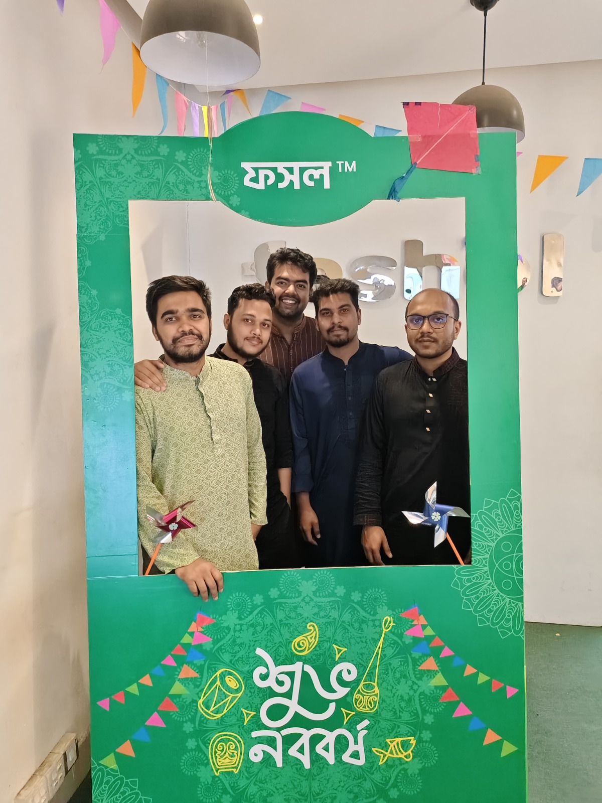
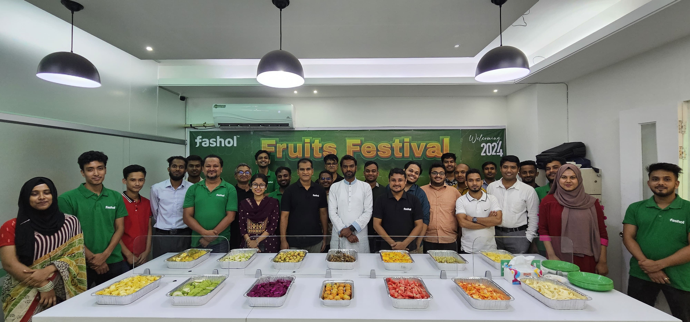
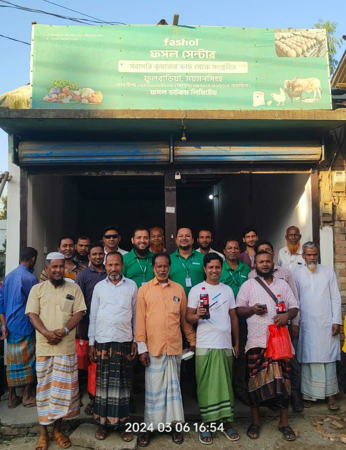
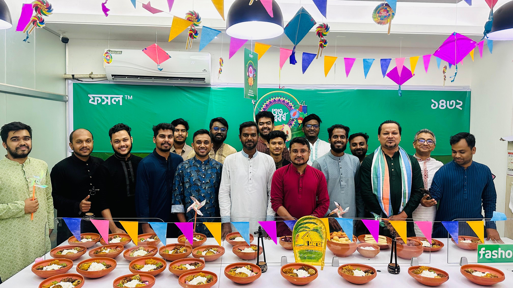
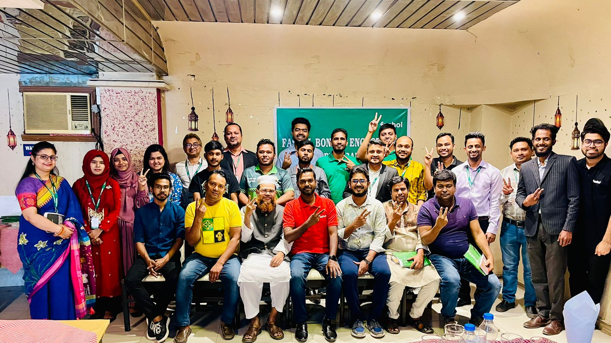
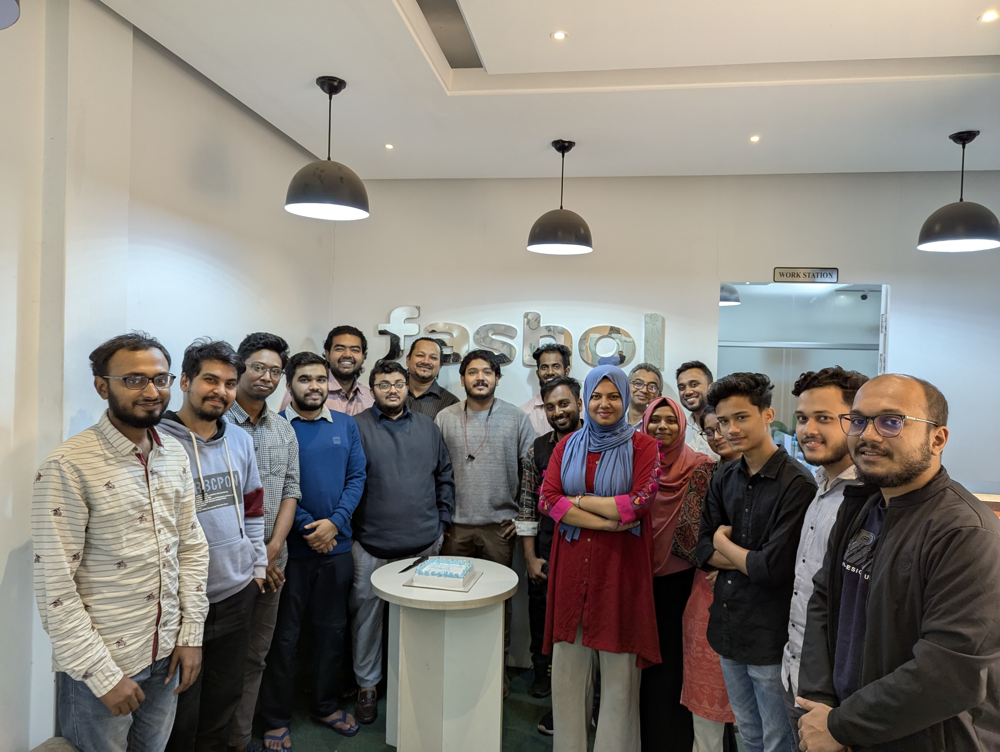

## Navigation

- 01 Overview → index.html
- 02 About → about.html
- 03 Services → services.html
- 04 News → news.html
- 05 Career → career.html (current page)
- 06 Contact → contact.html
- **CTA:** "Impact data →" → data.html

**Breadcrumb:** Overview / Career

# Work on the supply chain that feeds Bangladesh.

§ Career · 138 employees · Dhaka HQ · Hybrid · Hiring Q1 2026

We are 138 people — engineers, field agents, drivers, warehouse leads, data analysts, and finance partners — working out of nine districts and three countries. Roles below are **active this quarter**. Complete listings are on our hiring portal.

### Employment specifications

- **Team size:** 138 · Q1 2026
- **Districts:** 09 operating
- **HQ:** Kawran Bazar, Dhaka
- **Working model:** Hybrid · on-site for field ops
- **Languages:** Bengali · English
- **Benefits:** Health · leave · share option (employees)

**Fig. 01** — Company offsite, agricultural awareness day. Bangladesh, 2024.

## § 01 — Role categories

### Four disciplines. A platform and a fleet, not a software company.

Half of our team runs in the field. The other half builds the software that the field runs on. We hire for both with the same care.

#### 01 — ENGINEERING & DATA

##### Build the platform.

- Backend engineer (Node, Go)
- Android engineer (Jogaan)
- Data platform / ETL
- Pricing & forecasting analyst
- Platform SRE

#### 02 — LOGISTICS & OPS

##### Run the chain.

- Hub manager (9 districts)
- Fleet & route planner
- Cold-chain lead
- QC inspector (Grade tier)
- Warehouse supervisor

#### 03 — FIELD & FARMER

##### Meet the grower.

- Field agent — Satkhira, Jashore, Rajshahi, Bogura, Sylhet
- Agronomy lead
- Farmer relationship officer
- Bengali-first trainer

#### 04 — FINANCE, PEOPLE, GROWTH

##### Run the company.

- Finance controller
- Credit & settlement analyst
- Partnerships (export, QC)
- People & talent
- Communications

- **CTA:** "Browse open positions on hr.fashol.com" → https://hr.fashol.com/jobs

## § 02 — What you get

### Clear work, specific impact, a team that ships.

- **B.01 — Real impact, measured.** Every role ties to a number on the company scoreboard — farmers onboarded, waste reduced, settlement cycle.
- **B.02 — Competitive compensation.** Benchmarked against tech and logistics sector in Dhaka. Share option for all employees.
- **B.03 — Hybrid working.** Office-flexible in Dhaka. Field ops are on-site by necessity.
- **B.04 — Health & leave.** Full medical, parental, bereavement. 24 days leave + public holidays.
- **B.05 — Training & growth.** Annual learning stipend. Internal transfers between engineering and ops encouraged.
- **B.06 — A real mission.** Bangladesh's agricultural chain, rebuilt by people who were born into it. Work that lasts.

## § 03 — A day in the field

### Six moments, 06:00 → 19:00.

What the work looks like between field gate and dispatch dock. Satkhira collection centre and the Jashore route, one Thursday in October 2025.

**06:12 · Satkhira** — First registration of the morning. Field agent Rafiqul Mondol walks the farmer through the Jogaan onboarding flow — ID, photo, plot sketch, bank account. Forty minutes per farmer, on average.

**07:40 · Dumuria collection centre** — Weigh-in station. Every crate is tagged to the farmer's ID before it reaches the grading lane. Grade A cabbage (firm, 800 g minimum) gets the first pallet slot.

**09:05 · Hub office, Satkhira** — Slips reconcile against the Jogaan log. Every farmer receives an SMS with their weigh-in total and the BDT amount before the dispatch truck leaves the hub.

**11:20 · Jashore → Dhaka route** — Cold-chain dispatch. Temperature and dwell-time are logged per crate; target cabin temp is 4-6°C; a Grade A cabbage reaches Karwan Bazar with under 2% shrinkage.

**14:50 · Dumuria village circuit** — Walk-around with the next day's growers. Tomorrow's offer price is locked at 19:00 tonight; growers who plan to sell are walked through grading one more time.

**18:45 · Hub debrief, Satkhira** — End-of-day reconciliation. Total farmers served, total MT dispatched, total BDT settled. The 19:00 price publish goes out to every registered farmer's phone five minutes later.

All photographs: Fashol operations archive, 2024 – 2025. · Compare to the [12-month case study](case-study.html) that describes this same workflow from the farmer's side.

## § 04 — Apply

### Ready to join the team?

- **CTA:** "01 — See open roles — Live listings on hr.fashol.com. Updated weekly." → https://hr.fashol.com/jobs
- **CTA:** "02 — Speculative application — Role unlisted? Email us with a clear note of what you'd do." → mailto:careers@fashol.com
- **CTA:** "03 — Learn more first — Founders, timeline, and operating principles on the About page." → about.html

## Footer

ফসল — Bengali noun. A harvest.

A farm-to-business platform operating out of Dhaka, Singapore, and Dubai. Founded 2019.

### Site

- Overview → index.html
- About → about.html
- Services → services.html
- News → news.html
- Case study → case-study.html
- Data → data.html
- Career → career.html
- Contact → contact.html

### Offices

- **BD:** 130 Kabbokash, Kawran Bazar, Dhaka 1215
- **SG:** 33A Pagoda Street, Singapore 059192
- **AE:** Office 406, Abdullah Fahed Bldg 2, Al Qussais 2, Dubai

### Direct

- +880 9613 105 505 → tel:+8809613105505
- info@fashol.com → mailto:info@fashol.com
- Facebook → https://www.facebook.com/fasholcom/
- LinkedIn → https://www.linkedin.com/company/fashol?originalSubdomain=bd
- YouTube → https://www.youtube.com/channel/UCMAWUuelzAQc9nYKZ2s-fxQ

© 2019–2026 Fashol Dotcom Limited
Dhaka, Bangladesh
[Privacy](privacy.html) · [Terms](terms.html)
v 2026.04

Fashol · fashol.com
