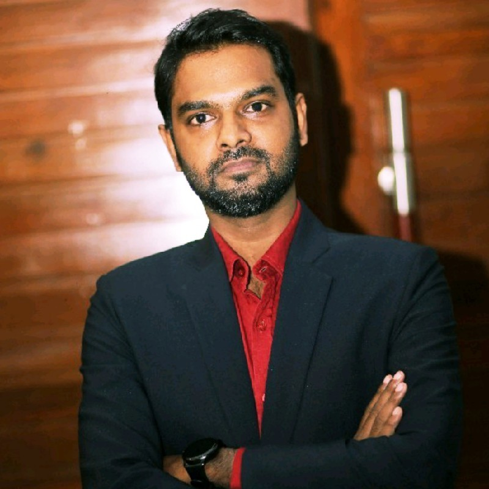

Skip to main content

## Furniture / Annotation

- Issue 001 · 2026.04
- Fashol signal mark
- 23.7514° N / 90.3943° E
- v 3.0 · BN

## Navigation

প্রধান মেনু:

- ০১ সূচনা → /index.bn
- ০২ আমরা কী করি → #kaaj
- ০৩ যোগান অ্যাপ → #jogaan
- ০৪ যুক্ত হোন → #join
- ০৫ যোগাযোগ → /contact

**CTA:** "EN ↗" → /index

**Mobile:** "মেনু"

# নামপট্ট / মাস্টহেড

ISSUE ০০২ · শুক্রবার, ১৭ এপ্রিল ২০২৬ · সরাসরি কৃষকের পাশে · ছয় বছর

## ফসল

*fashol*

*ফসল* — বাংলা বিশেষ্য। ফসল বা শস্য। যা কৃষক বছরে বোনে, সেই ফসলের ন্যায্য দাম।

# § ০০ — প্রতিষ্ঠাতার চিঠি

আমি যে বছরে বড় হয়েছি, সে বছরে বাজারে যেতে যেতে শুনতাম — "এই বছর কপি যাবে না", "পেঁয়াজ পঁচে গেছে", "পিঁয়াজুর দাম টিকছে না"। কৃষক লাগাতেন, সার দিতেন, পানি দিতেন, কাটতেন — তারপর বৃহস্পতিবারের হাটে যে দামে আড়তদার নেবেন, সে দামে ছেড়ে দিতে হতো। না দিলে সেই কপি বাড়িতে এনে সোমবার বিকেলে হলুদ হয়ে যেত।

ফসল শুরু করেছি এই একটিমাত্র সমস্যার জন্য — শৃঙ্খলের শেষ প্রান্তের মানুষ, কৃষক, সবার পরে পান, সবচেয়ে কম পান, এবং এমনভাবে পান যেখানে তাঁর কোনো হিসাব নেই, ব্যাংকের কোনো কাগজ নেই, পরের মাসে ঋণ পাওয়ার কোনো প্রমাণ নেই। আমরা কৃষির শৃঙ্খল পাল্টানোর চেষ্টা করছি না। আমরা করছি একটি কাজ — কৃষক যা বোনেন, সেটা যেন তিনি সরাসরি ক্রেতার কাছে বেচতে পারেন, প্রকাশিত দামে, ২৪ ঘণ্টার মধ্যে পরিশোধে, এবং এমন কাগজে যেটা তিনি আগামীকাল ব্যাংকে নিয়ে গেলে ঋণ মেলে।

যা এখানে লেখা হবে, সব তার জন্য লেখা। বাকিটা — বিনিয়োগ, কারিগরি, পুরস্কার — সেটা পরের পাতায়।

— সাকিব হোসাইন, প্রতিষ্ঠাতা ও সিইও। ঢাকা, এপ্রিল ২০২৬।

# § ০১ — সংখ্যায় ফসল

- **২৫,০০০+** নিবন্ধিত কৃষক — ২০১৯ থেকে আজ পর্যন্ত · ৯টি জেলায় বিস্তৃত
- **৫,০০০+** সক্রিয় ক্রেতা — সুপারশপ · রপ্তানি · রেস্তোরাঁ · প্রক্রিয়াজাত প্রতিষ্ঠান
- **~১,০৫০ MT** প্রতি মাসে সরবরাহ — শীতের মৌসুমে সর্বোচ্চ; ২০২৬ প্রথম প্রান্তিক পর্যন্ত গড়।
- **২৪ ঘ.** পরিশোধ সময় — কৃষকের নির্ধারিত ব্যাংক বা bKash হিসাবে।

# § ০২ — আমরা কী করি

## সরাসরি খামার থেকে ক্রেতা পর্যন্ত — পাঁচটি ধাপ, একটি প্ল্যাটফর্ম।

বাংলাদেশের কৃষিবাজারে গড়ে পাঁচ হাত ঘুরে একটি সবজি ভোক্তার কাছে পৌঁছায়। ফসল সেই পথ ছোট করে: মাঠ → সংগ্রহকেন্দ্র → শীতল পরিবহন → ক্রেতা → ভোক্তা। মাঝের অস্বচ্ছতা সরিয়ে, কৃষকের নামে সরাসরি লেনদেন।

### ধাপ ০১ — মাঠে নিবন্ধন

ফসলের মাঠ প্রতিনিধি গ্রামে গিয়ে কৃষককে যোগান অ্যাপে নিবন্ধন করেন। জাতীয় পরিচয়পত্র, একটি ছবি, জমির মানচিত্র, ব্যাংক বা bKash নম্বর — সব মিলিয়ে ৪০ মিনিট। নিবন্ধন ফি নেই; মাসিক চাঁদা নেই।

### ধাপ ০২ — সন্ধ্যা ৭টায় দামের সংকেত

প্রতিদিন সন্ধ্যা ৭টায় অ্যাপে পরদিনের সংগ্রহমূল্য প্রকাশ হয়। কৃষক দেখে নেন দাম, গ্রেড, এবং সংগ্রহের সময়। একমত হলে ভোরেই ফসল প্রস্তুত করেন; না হলে পরের দিন অপেক্ষা করেন।

### ধাপ ০৩ — মাঠ-প্রান্ত সংগ্রহ

সকালে ফসল গ্রহণ-কেন্দ্রে ওজন হয়। প্রতিটি ক্রেট কৃষকের আইডিতে ট্যাগ হয়, গ্রেড A/B আলাদা হয়, এবং শীতল ট্রাকে উঠে যায়। কৃষকের মোবাইলে তাৎক্ষণিক SMS যায় — ওজন, গ্রেড, পরিমাণ।

### ধাপ ০৪ — শীতল পরিবহন ও পৌঁছানো

৪–৬°C তাপমাত্রায় ট্রাক সরাসরি ক্রেতার কাছে যায় — ঢাকার সুপারশপ, সিঙ্গাপুরের রপ্তানি টার্মিনাল, অথবা প্রক্রিয়াজাত ইউনিট। শীতল শৃঙ্খলে নষ্ট ২% এর কম থাকে।

### ধাপ ০৫ — ২৪ ঘণ্টায় পরিশোধ

ক্রেতা গ্রহণের ২৪ ঘণ্টার মধ্যে কৃষকের ব্যাংক/bKash হিসাবে টাকা পৌঁছায়। প্রতিটি লেনদেনের রেকর্ড কৃষকের নামে জমা হয় — ভবিষ্যতে কৃষি ঋণ, বিমা, বা সরকারি প্রণোদনার দরকারি কাগজ।

# § ০৩ — তর্কটা টাকায়

## এক কেজি বাঁধাকপিতে কৃষক আসলে কত পান।

যশোর ও সাতক্ষীরার ২০২৪ শীত মৌসুমের গড় হিসাব। প্রচলিত আড়তদার-শৃঙ্খল বনাম ফসলের সরাসরি সংগ্রহ।

### চিত্র ০২ — কপি Grade A, মূল্য প্রবাহ। ২০২৪ শীত মৌসুম, গড় BDT / কেজি।

*[Inline SVG figure: comparison bar chart]*

Title: দুইটি সরবরাহ শৃঙ্খলের তুলনা — প্রচলিত আড়তদার চেইনে কৃষক BDT 12 পান, ফসল চেইনে BDT 27 পান; ভোক্তা মূল্য উভয় ক্ষেত্রে BDT 58।

| Chain | কৃষক | মধ্যস্বত্বভোগী | ভোক্তা মূল্য |
|---|---|---|---|
| প্রচলিত আড়তদার চেইন | BDT ১২ / ২০% | → আড়তদার → হোলসেল → খুচরা → | BDT ৫৮ ভোক্তা |
| ফসল সরাসরি সংগ্রহ | BDT ২৭ / ৪৬% | → হাব → ক্রেতা → | BDT ৫৮ ভোক্তা |

Delta annotation: **+ BDT ১৫ / কেজি** — কৃষকের আয় +১২৫%

Footnote links:
- বারো মাসের একটি কৃষকের হিসাব → /case-study
- ২০১৯ → ২০২৬ পুরো তথ্য → /data

# § ০৪ — যোগান অ্যাপ

## যোগান

### মাঠ যে অ্যাপে চলে।

যোগান একটি বাংলাভাষী অ্যান্ড্রয়েড অ্যাপ। Play Store-এ বিনামূল্যে পাওয়া যায়। প্রতিদিন সন্ধ্যা ৭টায় পরদিনের দাম আসে; সকালে সংগ্রহ; ২৪ ঘণ্টার মধ্যে টাকা। কৃষকের প্রতিটি লেনদেন নিজের নামে জমা থাকে।

- বাংলা ভাষায়; ছবি ও ভয়েস-গাইড সহ
- কোনো নিবন্ধন ফি নেই
- একমত হলে সকালে ফসল তৈরি; না হলে পরের দিন
- আপনার জমির কোনো একচেটিয়া চুক্তি নেই

**CTA:** "Play Store-এ যোগান ডাউনলোড করুন" → https://play.google.com/store/apps/details?id=com.fashol.jogaan

# § ০৫ — কিভাবে যুক্ত হবেন

## তিনটি পথ, একটিই লক্ষ্য।

আপনার জেলায় ফসল সক্রিয় থাকলে যেকোনো একটি পথে শুরু করুন। প্রত্যেকটি বিনামূল্যে; কোনো জামানত নেই।

### ০১ — যোগান অ্যাপ ডাউনলোড করুন

Play Store থেকে "যোগান" সার্চ করে অ্যাপ ইনস্টল করুন। মোবাইল নম্বর ও NID দিয়ে নিজেই নিবন্ধন শুরু করুন। ৪৮ ঘণ্টার মধ্যে আপনার এলাকার মাঠ প্রতিনিধি যোগাযোগ করবেন।

### ০২ — কাছের হাবে যান

সাতক্ষীরা · যশোর · রাজশাহী · বগুড়া · খুলনা · ময়মনসিংহ · কুমিল্লা · ঢাকা (সাভার) · সিলেট — এই ৯টি জেলায় ফসলের সংগ্রহকেন্দ্র সক্রিয়। হাবে গেলে একজন এজেন্ট সাথে সাথে নিবন্ধন করিয়ে দেবেন।

### ০৩ — ফোন বা মেসেজ করুন

- কল: +৮৮০ ৯৬১৩ ১০৫ ৫০৫
- ইমেইল: info@fashol.com
- Facebook: fasholcom — সরাসরি বার্তা পাঠান।

# § ০৬ — প্রতিষ্ঠাতাগণ

## তিন প্রতিষ্ঠাতা, তিন শৃঙ্খলা, একটি উদ্দেশ্য।

### ০১ — প্রতিষ্ঠাতা ও সিইও — সাকিব হোসাইন

> "আমি মঙ্গলে আলু পৌঁছে দিতে চাই।"

পূর্বে প্রকৌশলী। ২৬ বছর বয়সে ছয়টি জেলায় মাঠপর্যায়ে তিন বছর কাজের পর ফসল শুরু করেন। Forbes, ২০২৫-এ স্বীকৃত।

### ০২ — সহ-প্রতিষ্ঠাতা ও সিওও — মামুনুর রশিদ

> "আমরা সেই অবকাঠামো গড়ছি যা খাবারের প্রবাহকে সংজ্ঞায়িত করবে।"

দক্ষিণ এশিয়ায় লজিস্টিকস ও FMCG খাতে ২০ বছর অভিজ্ঞতা। হাব নেটওয়ার্ক ও মাঠ প্রতিনিধি কর্মসূচি পরিচালনা করেন।

### ০৩ — সহ-প্রতিষ্ঠাতা ও সিএফও — নুমাইর হুসাইন

> "কৃষকের জন্য ন্যায্য আয়ের পক্ষে দাঁড়াই।"

সিঙ্গাপুর ভিত্তিক অর্থ ও বিনিয়োগ বিশেষজ্ঞ। ফসলের বৈদেশিক সম্প্রসারণ ও Series A তদারকি করেন।

# § ০৭ — আজকেই শুরু করুন

## আগামী বৃহস্পতিবারের আগে নিবন্ধন সেরে ফেলুন।

যোগান অ্যাপ ইনস্টল থেকে মাঠে সংগ্রহ পর্যন্ত — সর্বোচ্চ ৫ কর্মদিবস।

### ০১ — যোগান অ্যাপ ইনস্টল করুন

Play Store · বাংলা · বিনামূল্যে

**CTA:** "যোগান অ্যাপ ইনস্টল করুন" → https://play.google.com/store/apps/details?id=com.fashol.jogaan

### ০২ — কল করুন

+৮৮০ ৯৬১৩ ১০৫ ৫০৫

**CTA:** "কল করুন" → tel:+8809613105505

### ০৩ — কাছের হাব খুঁজুন

৯টি জেলায় সংগ্রহকেন্দ্র

**CTA:** "কাছের হাব খুঁজুন" → /contact

## Footer

ফসল — বাংলা বিশেষ্য। ফসল, শস্য।

বাংলাদেশের একটি farm-to-business প্ল্যাটফর্ম। ঢাকা, সিঙ্গাপুর ও দুবাইতে অফিস। ২০১৯ সালে প্রতিষ্ঠিত।

### পাতাসমূহ

- সূচনা → /index.bn
- আমরা কী করি → #kaaj
- যোগান অ্যাপ → #jogaan
- যুক্ত হোন → #join
- যোগাযোগ → /contact
- English site ↗ → /index

### অফিস

- **BD** — ১৩০ কব্বকাশ, কাওরান বাজার, ঢাকা ১২১৫
- **SG** — 33A Pagoda Street, Singapore 059192
- **AE** — Office 406, Abdullah Fahed Bldg 2, Al Qussais 2, Dubai

### সরাসরি

- +৮৮০ ৯৬১৩ ১০৫ ৫০৫
- info@fashol.com
- Facebook → https://www.facebook.com/fasholcom/
- LinkedIn → https://www.linkedin.com/company/fashol
- YouTube → https://www.youtube.com/channel/UCMAWUuelzAQc9nYKZ2s-fxQ

### Footer bottom

© ২০১৯–২০২৬ ফসল ডটকম লিমিটেড · ঢাকা, বাংলাদেশ · গোপনীয়তা · শর্তাবলি · v ২০২৬.০৪

Print footer: Fashol · fashol.com
