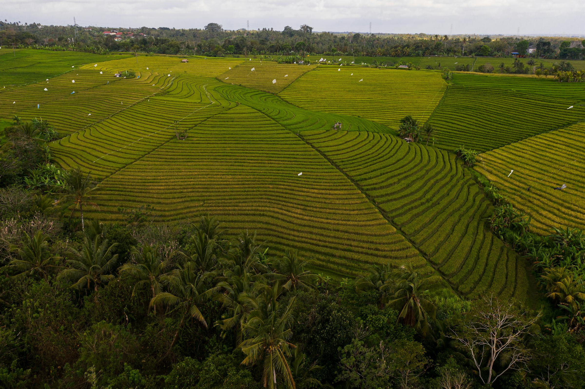
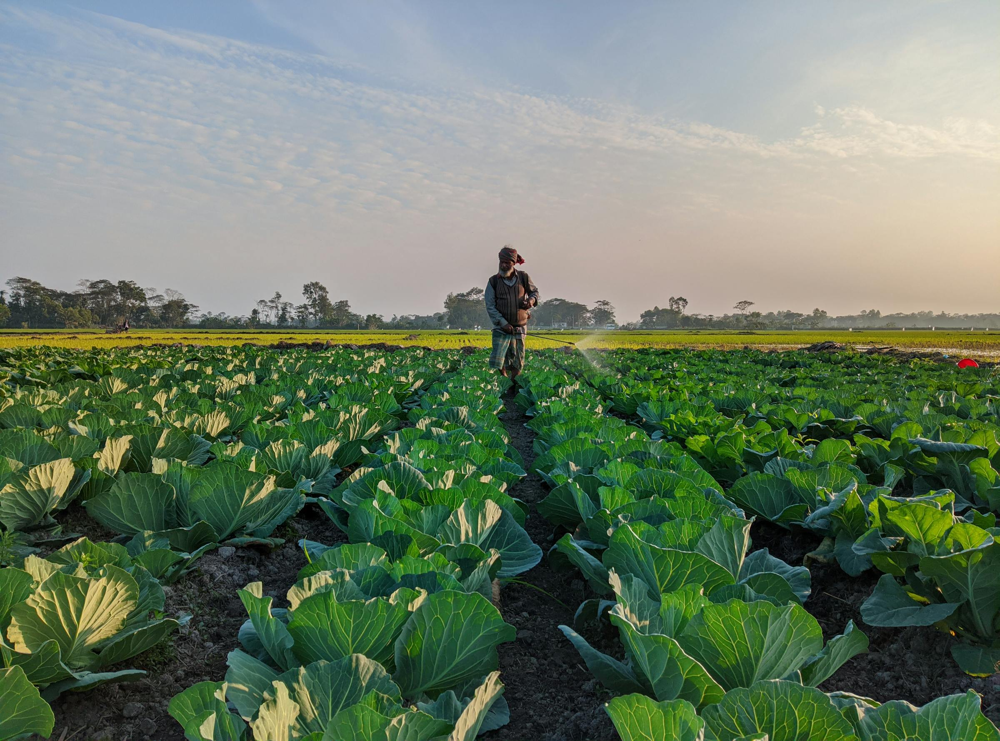
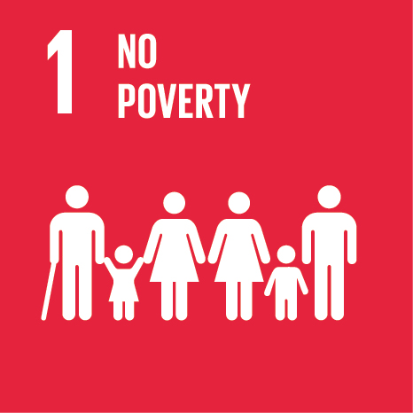
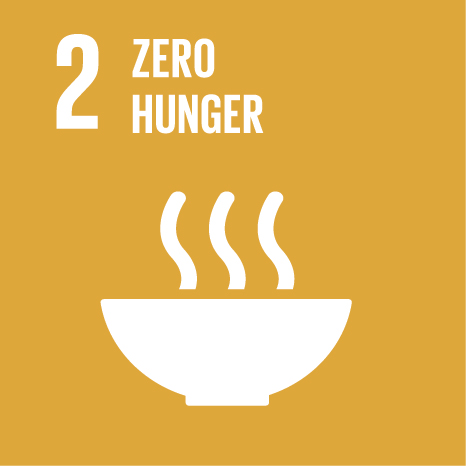
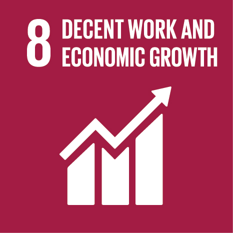
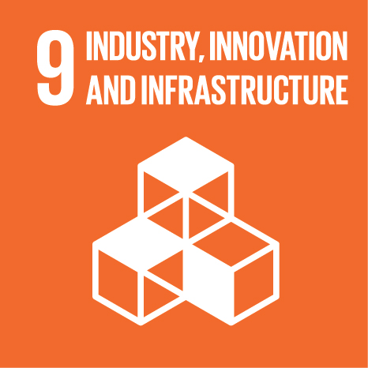
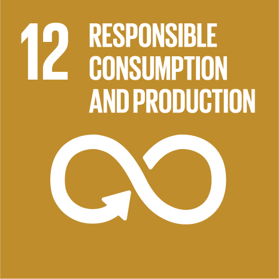
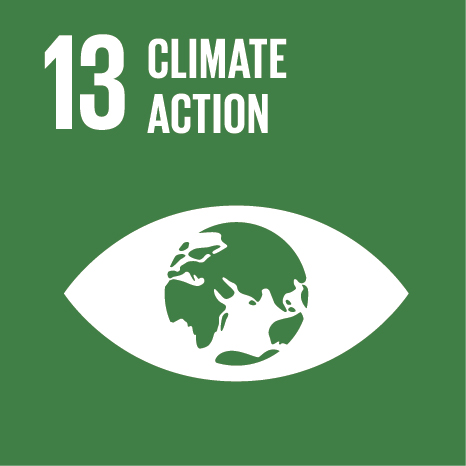
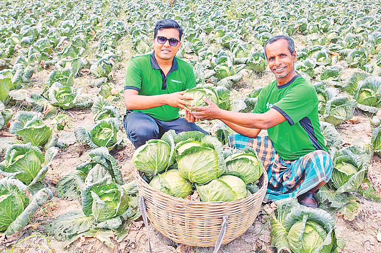
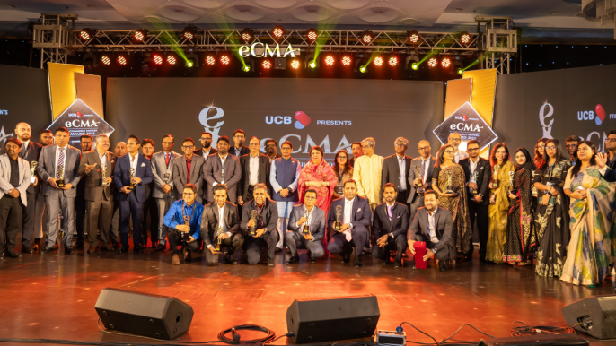

## Navigation

- 01 Overview → /index.html (current page)
- 02 About → /about.html
- 03 Services → /services.html
- 04 News → /news.html
- 05 Career → /career.html
- 06 Contact → /contact.html

**CTA:** "বাংলা ↗" → /index.bn.html
**CTA:** "Impact data →" → /data.html
**CTA:** "Menu" → (mobile nav toggle)

## Masthead strip

Issue 001 · Friday, 17 April 2026 · The Overview · 23.7514° N / 90.3943° E · Dhaka, Bangladesh

## Hero

A supply chain for

# 25,000+ farmers, between the paddy field and the market.

Fashol moves perishable produce from farms across Bangladesh to buyers in Dhaka, Singapore, and Dubai. Direct pricing. Real-time logistics. **26 percent less waste.**

**CTA:** "Partner with Fashol" → /contact.html
**CTA:** "Read the data" → /data.html

### At a glance — § — The register, 2026

| Metric | Value |
|---|---|
| Farmers | 25,000+ |
| Hubs | 40+ |
| Waste cut | 26% |
| Food loss prevented | 10,000 MT |
| Pre-seed | $1M USD |
| Cycle time | 18-24 h |

Audited quarterly. → [data.html](/data.html)

**Fig. 01** — Rice paddies, aerial view. South Asia, 2023. — The field itself, a grid. Photograph via Pexels (CC0).

---

## Chapter I — § 01 — 02.1 · The argument

## § 01 — Proof, 2026

| Number | Label |
|---|---|
| 25,000+ | Smallholder farmers onboarded |
| 40+ | Distribution hubs across Bangladesh |
| 26% | Reduction in post-harvest waste |
| 10,000 MT | Food loss prevented, cumulative |
| $1M USD | Pre-seed raised, SOSV / SATP / angels |
| 06 yrs | In operation, since 2019 |

## § 02 · ০২ — What Fashol does

### Direct procurement from the farm gate; disciplined delivery to the buyer.

Bangladesh's agricultural supply chain passes produce through five to seven intermediaries before it reaches a retailer. Pricing is opaque. Payment is late. Roughly a third of what is grown spoils before it is sold. Fashol removes the middle layers and replaces them with a platform — agent network, cold logistics, quality grading, settlement.

### Fig. 02 — The Fashol chain, five nodes. Cycle time: 18–24 hours, farm gate → buyer door.

*[Inline SVG figure: supply-chain diagram, five sequential nodes connected by arrows with timestamps]*

Title: Fashol supply-chain diagram, five nodes from farmer to buyer.

| # | Node | Role | Meta line 1 | Meta line 2 | Time |
|---|---|---|---|---|---|
| 01 | FARMER | Smallholder | 25,000 onboarded | Records via Jogaan app | T + 0h |
| 02 | FIELD AGENT | Collection & price lock | 40+ hubs | 4-tier grade at intake | T + 4h |
| 03 | COLD HUB | Storage & dispatch | 26% waste reduction | Route-planned fleet | T + 12h |
| 04 | PLATFORM | Matching & settlement | 24h farmer payout | Mobile financial services | T + 18h |
| 05 | BUYER | MSME / QC / Exporter | 5,000+ buyer accounts | Dhaka / SG / Dubai | (final) |

### Stage 01 — Farm-gate onboarding

Field agents register smallholders via the **Jogaan** app. Each farmer holds a record of what they grow, when, in what quantity, and at what price. No paper ledger. No verbal agreement. Transparent from day one.

### Stage 02 — Cold logistics & grading

Pickup, cold storage, and a four-tier quality grade applied at hub intake. Produce is catalogued before it leaves the district — not relabeled at the urban wholesale market, as is the common practice.

### Stage 03 — Settlement & dispatch

Buyers — MSMEs, quick-commerce operators, exporters, wholesalers — order through the platform. Farmers are paid via mobile financial services within 24 hours of weighing. Delivery runs on company route plans, not on aratdar convenience.

**Fig. 03** — Cabbage collection, company-registered farmer. Jashore district, 2024. Photograph by Adil Ahnaf.

## § 02.1 · ০২.১ — Operations register

### Forty-plus hubs. Nine districts. One platform behind every farmer.

A partial index of current operating districts. Numbers are reported internally and audited quarterly.

### Fig. 04 — Fashol operating districts, Bangladesh. 2026 Q1.

*[Inline SVG figure: map of Bangladesh with 8 division polygons and 9 hub markers]*

Title: Map of Bangladesh showing Fashol distribution hubs across eight divisions.

Divisions (8): Dhaka, Chattogram, Rajshahi, Khulna, Sylhet, Rangpur, Mymensingh, Barishal.

Hub markers (HQ + 9 districts):
- Dhaka (Savar) — HQ
- Satkhira
- Jashore
- Rajshahi
- Bogura
- Khulna
- Mymensingh
- Comilla
- Sylhet

Map labels visible: DHAKA · HQ, Rajshahi, Rangpur, Mymensingh, Sylhet, Chattogram, Khulna, Barishal.

Scale bar: 0 km — 100 — 200.

Legend:
- HQ · Dhaka
- District hub
- 08 divisions · 09 listed

Compass: N (north).

### Table 01 — Operating districts, 2026 Q1. Internal reporting.

| No. | District | Division | Hubs | Farmers | Volume / mo. | Since | Leading crops |
|---|---|---|---|---|---|---|---|
| 01 | Satkhira | Khulna | 06 | 4,820 | 180 MT | 2019 | Paddy, Cabbage, Potato |
| 02 | Jashore | Khulna | 05 | 3,610 | 142 MT | 2020 | Cabbage, Tomato, Chilli |
| 03 | Rajshahi | Rajshahi | 05 | 3,210 | 128 MT | 2021 | Paddy, Mango, Onion |
| 04 | Bogura | Rajshahi | 04 | 2,940 | 110 MT | 2021 | Potato, Cauliflower |
| 05 | Khulna | Khulna | 04 | 2,180 | 96 MT | 2022 | Paddy, Aubergine |
| 06 | Mymensingh | Mymensingh | 04 | 2,060 | 84 MT | 2022 | Tomato, Gourd, Okra |
| 07 | Comilla | Chattogram | 04 | 1,980 | 78 MT | 2023 | Paddy, Chilli, Bottle Gourd |
| 08 | Dhaka (Savar) | Dhaka | 05 | 1,540 | 74 MT | 2019 | Leafy greens, Radish |
| 09 | Sylhet | Sylhet | 03 | 1,280 | 62 MT | 2024 | Tea, Lemon, Ginger |
| **Total, reported 2026 Q1** | | | **40+** | **25,000+** | **~1,050 MT** | | |

---

## Chapter II — § 02.2 — 00 · The evidence

## § 02.2 · ০২.২ — The argument, in takas

### What a farmer actually earns for one kilo of cabbage.

Comparison between the traditional aratdar chain and Fashol direct procurement. Figures are averages across Jashore and Satkhira, 2024 harvest season.

### Fig. 05 — Farmer share of end-consumer price, BDT per kg. Lower bars = less to the grower.

*[Inline SVG figure: horizontal bar chart, two rows]*

Title: Horizontal bar chart comparing what a farmer receives per kilo of cabbage under the traditional aratdar chain versus Fashol direct procurement.

Axis: BDT / kg — ticks at 0, 20, 40 (with minor ticks at 10, 30, 50).

Rows:

| Row | Label | Sub-label | Farmer share | Farmer % | End-consumer price |
|---|---|---|---|---|---|
| 01 | TRADITIONAL | aratdar chain | BDT 12 | 20% | BDT 60 end-consumer |
| 02 | FASHOL | direct procurement | BDT 27 | 46% | BDT 58 end-consumer |

Delta annotation: **+ BDT 15 / kg = +125% farmer income**

Footnotes:
1. Traditional chain assumes five intermediaries: farmer → local trader → aratdar → urban wholesaler → retailer → consumer.
2. Fashol chain: farmer → field agent → hub → buyer → consumer. Cold-chain loss and quality grading applied at intake.
3. Averages for Grade A cabbage, Jashore & Satkhira, Nov 2024 – Feb 2025. Internal reporting; figures rounded to the nearest BDT.

Read the same argument traced through one farmer's year →
**CTA:** "One farmer, twelve harvests" → /case-study.html
**CTA:** "Full impact data, 2019 → 2026" → /data.html

## § 02.3 · ০২.৩ — Seasonal calendar

### Seven crops. Twelve months. Peak windows, mapped.

The Fashol network's leading seven crop lines, indexed against the months they peak across our operating districts. Grey = off-season. Terracotta = peak harvest. Use this to plan procurement or farmer onboarding.

### Fig. 06 — Crop peak calendar, 2026. Jashore · Satkhira · Rajshahi · Bogura · Comilla composite.

*[Inline SVG figure: heatmap of seven crops × twelve months; cell intensity = off / low / mid / peak]*

Title: Heatmap of seven crops across twelve months showing peak harvest windows.

Months header: JAN, FEB, MAR, APR, MAY, JUN, JUL, AUG, SEP, OCT, NOV, DEC.

Crop rows (with botanical names) and per-month intensity:

| Crop | Latin | JAN | FEB | MAR | APR | MAY | JUN | JUL | AUG | SEP | OCT | NOV | DEC |
|---|---|---|---|---|---|---|---|---|---|---|---|---|---|
| Paddy | Oryza sativa | peak | mid | low | off | off | low | mid | mid | low | mid | peak | peak |
| Cabbage | B. oleracea | peak | peak | mid | off | off | off | off | off | low | mid | peak | peak |
| Potato | S. tuberosum | peak | peak | peak | mid | low | off | off | off | off | low | mid | peak |
| Tomato | S. lycopersicum | peak | mid | low | off | off | off | off | off | low | mid | peak | peak |
| Chilli | Capsicum | mid | mid | peak | peak | mid | low | off | low | mid | peak | peak | mid |
| Onion | A. cepa | low | mid | peak | peak | mid | low | off | off | off | low | mid | mid |
| Mango | M. indica | off | off | off | low | mid | peak | peak | mid | low | off | off | off |

Legend: Off · Low · Mid · Peak.

Composite across five operating districts · 2026 planning.

## § 00 · ০০ — Editorial

From the founder · Sakib Hossain · Dhaka, April 2026

### *What we talk about when we talk about a supply chain.*

I grew up in a country where the farmer who fed half the city couldn't feed his own children through a bad season. That isn't an essay, it is a balance sheet. The price a grower of tomatoes in Jashore receives is roughly one-fifth of what a customer pays at a Dhaka supermarket. The other four-fifths lives in the five to seven people who sit between the field and the shelf. Most of them add nothing — not cold-chain, not grading, not a trade service, not even a receipt.

We built Fashol to remove as many of those layers as we could, and to replace them with a platform that earns its place. Software where the farmer owns the record. Cold-chain in districts that had none. A four-tier grade applied at hub intake. Settlement in twenty-four hours. None of these ideas are clever. The work is doing them, every day, in nine districts, across a seasonal economy that doesn't wait.

We are **25,000 farmers, 40-plus hubs, 26 percent less waste**, and a few early numbers that say the model holds. We are also a long way from done. If you are a farmer, a buyer, an engineer, or a policy person who thinks Bangladesh deserves a properly-designed agricultural chain, you should be working on this with us.

— Sakib Hossain — Founder & CEO — Kawran Bazar, Dhaka

---

## Chapter III — § 03 — 09 · The invitation

## § 03 · ০৩ — Services

### Six services. One platform. Every stage of the chain.

1. **Farm-to-market platform** — Direct farmer-to-buyer matching. No aratdars. Pricing visible to both sides. *(Fashol · B2B)*
2. **Smart logistics network** — Cold chain and last-mile pickup for rural, climate-vulnerable districts. *(Fleet · Route)*
3. **Buyer solutions** — Ordering, inventory, fulfilment for MSMEs, quick-commerce, exporters, wholesalers. *(SaaS · Retail)*
4. **Market intelligence** — Real-time price data and seasonal analytics for smallholder decision-making. *(Data · Pricing)*
5. **Quality assurance** — Four-tier grading applied at hub intake — before stock reaches the buyer. *(Grade · QC)*
6. **Financial solvency** — 24-hour settlement via mobile money. Agricultural credit for established growers. *(Payments · Credit)*

**CTA:** "See the full services index, including the Jogaan app" → /services.html

## § 04 · ০৪ — Operating principles

### Six principles. Operational, not aspirational.

Written into how we decide, hire, and settle with farmers.

#### P.01 — Farmer first
Every pricing decision starts from what the grower will take home. Not from the margin the platform can hold.

#### P.02 — Accountability
Named owners for each commitment — to farmers, to buyers, to investors. Escalation paths are visible.

#### P.03 — Sustainability
Waste reduction is measured per district, per season, per crop. It is a ledger entry, not a talking point.

#### P.04 — Human-centered
Jogaan is tested with agents and farmers who have never used a smartphone. If they cannot use it, it ships again.

#### P.05 — Optimisation
Data first. First principles next. Opinion last. Decisions are traceable to numbers we can show.

#### P.06 — Leadership
Bangladesh's agricultural infrastructure deserves to be designed, not inherited. We carry that responsibility.

## § 05 · ০৫ — Voice from the field

> Fashol has changed the shape of my farming. Prices are **25 percent higher** than what the aratdar paid me — and the money is in my mobile wallet within a day, not a month.
>
> — Mohammad Rahim Uddin — Vegetable farmer, Satkhira — Onboarded 2023

**Fig. 07** — A registered farmer sowing. Rice paddy, South Asia, 2024.

## § 06 · ০৬ — Trust register

### Twenty partners. Five investors. Ten publications on record.

The network we have built is the most accurate description of who we are. Each entry below is a relationship we can document.

### Partners — 20 of record

### Investors — 05 of record

### In the press — selected

- 2024.02 — Prothom Alo — সাকিবের ফসল ডটকমে যুক্ত ১১ হাজার কৃষক
- 2023.04 — The Daily Star — Agri-tech startup Fashol secures Tk 10 Crore pre-seed investment
- 2023.04 — Dhaka Tribune — Agritech startup Fashol gets $1m pre-seed investment
- 2023.04 — Tech in Asia — Bangladesh-based startup bags $1m to solve agri-supply problems
- 2023.11 — The Business Standard — e-Commerce Movers Award (eCMA) 2023
- 2024.07 — AgFunder News — Fashol joins GROW Impact Accelerator, cohort five
- 2024.09 — Orbit Startups — Cutting out the middleman — farmers & retailers in Bangladesh
- 2025.04 — Forbes — Sakib Hossain — founder feature

**CTA:** "Complete news index (10 entries)" → /news.html

## § 07 · ০৭ — SDG alignment

### Six of seventeen UN Sustainable Development Goals, mapped to operations.

We audit against these each quarter. The icon is the UN's; the measurement is ours.

#### SDG 01 — No poverty

Farmer income lift, measured at onboarding vs. 12-month benchmark.

#### SDG 02 — Zero hunger

Food loss prevented in metric tons, per district, per season.

#### SDG 08 — Decent work

Full-time hub roles created in rural districts with historically thin employment.

#### SDG 09 — Industry & infrastructure

Cold storage and route-planning built in districts previously served by none.

#### SDG 12 — Responsible consumption

Quality grading reduces returns; traceability reduces over-ordering.

#### SDG 13 — Climate action

Climate-vulnerable farmers prioritised for onboarding in flood-prone coastal belts.

## § 08 · ০৮ — Latest news

### In the press — latest three.

**CTA:** "All news (10)" → /news.html

#### 2025.04 — Forbes

**Sakib Hossain — founder feature.**
Bangladeshi entrepreneur, founder of Fashol, on direct market access and the economics of perishables.
**CTA:** "Read the piece" → /news-3.html

#### 2024.02 — Prothom Alo

**সাকিবের ফসল ডটকমে যুক্ত ১১ হাজার কৃষক**
Prothom Alo covers the onboarding of 11,000 additional farmers, direct from field visits in Satkhira.
**CTA:** "Read the article" → /news-1.html

#### 2023.11 — The Business Standard

**e-Commerce Movers Award (eCMA) 2023.**
Fashol named among recognised e-commerce operators in Bangladesh by e-CAB.
**CTA:** "Read the article" → /news-4.html

## § 09 · ০৯ — Join

### The chain is still being built. Join as a farmer, a buyer, or a colleague.

#### 01 — Farmer onboarding
WhatsApp a field agent. Bring your last season's records, if available.
**CTA:** "Farmer onboarding →" → https://wa.me/+8801810187230?text=Hello%21%20I%E2%80%99d%20like%20to%20register%20as%20a%20farmer%20with%20Fashol.

#### 02 — Buyer account
MSMEs, quick-commerce, exporters, wholesalers. Ten-minute setup.
**CTA:** "Buyer account →" → https://wa.me/+8801810187230?text=Hello%21%20I%E2%80%99d%20like%20to%20buy%20produce%20through%20Fashol.

#### 03 — Work with us
Open roles in engineering, logistics, field operations, and data.
**CTA:** "Work with us →" → /career.html

## Accessibility / print-only

- Skip-link: "Skip to main content" → #main
- Print footer: "Fashol · fashol.com"
- Decorative furniture (top-left): "Issue 001 · 2026.04"
- Decorative furniture (bottom-left coordinate): "23.7514° N / 90.3943° E"
- Decorative furniture (bottom-right): "v 3.0 · EN"

## Footer

ফসল — Bengali noun. A harvest.

A farm-to-business platform operating out of Dhaka, Singapore, and Dubai. Founded 2019. Registered as Fashol Dotcom Limited (BD), Fashol Singapore Pte Ltd (SG).

### Site

- Overview → /index.html
- About → /about.html
- Services → /services.html
- News → /news.html
- Case study → /case-study.html
- Data → /data.html
- Career → /career.html
- Contact → /contact.html

### Offices

- **BD** — 130 Kabbokash, Kawran Bazar, Dhaka 1215
- **SG** — 33A Pagoda Street, Singapore 059192
- **AE** — Office 406, Abdullah Fahed Bldg 2, Al Qussais 2, Dubai

### Direct

- +880 9613 105 505 → tel:+8809613105505
- info@fashol.com → mailto:info@fashol.com
- Facebook → https://www.facebook.com/fasholcom/
- LinkedIn → https://www.linkedin.com/company/fashol?originalSubdomain=bd
- YouTube → https://www.youtube.com/channel/UCMAWUuelzAQc9nYKZ2s-fxQ

### Footer bottom

© 2019–2026 Fashol Dotcom Limited · Dhaka, Bangladesh · [Privacy](/privacy.html) · [Terms](/terms.html) · v 2026.04
