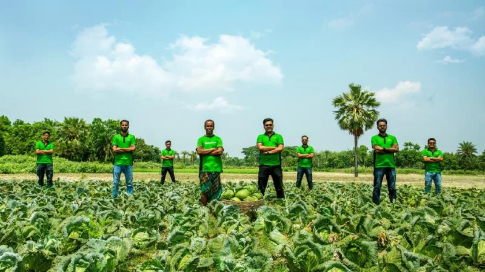

## Navigation

- 01 Overview → index.html
- 02 About → about.html
- 03 Services → services.html
- 04 News → news.html (current)
- 05 Career → career.html
- 06 Contact → contact.html

**CTA:** "Impact data →" → data.html

### Breadcrumb

Overview / News / The Daily Star / 2023

**CTA:** "← Back to News index" → news.html

# Agri-tech startup Fashol secures Tk 10 Crore pre-seed investment

**2023.04.13 — The Daily Star — Investment — Entry 02 / 10**

Fashol closed $1M in pre-seed funding from SOSV, South Asia Tech Partners, and Foodpanda co-founders Ambareen Reza and Zubair Siddiky.

*Fig. 01 — Bangladesh Tribune photograph of a Fashol collection day, 2023.*

## Article body

Fashol, a Bangladesh-headquartered agri-tech startup, raised Tk 10 Crore — approximately $1 million — in pre-seed funding in April 2023. The round was led by SOSV, with participation from South Asia Tech Partners and several angel investors, including Ambareen Reza, Co-Founder and CEO of Foodpanda Bangladesh, and Zubair Siddiky, Co-Founder and Managing Director of Foodpanda Bangladesh.

The company said it would use the capital to extend its field agent network, build cold-chain infrastructure in climate-vulnerable districts, and mature the Jogaan app into a full-stack agent and farmer platform.

At the time of the raise, Fashol was operating in five districts with approximately 4,200 registered farmers and twenty-two distribution hubs.

— End of article.

## Entry metadata

- **Date:** 2023.04.13 (2023-04-13)
- **Outlet:** The Daily Star
- **Category:** Investment
- **By:** Fashol Team
- **Entry:** 02 of 10
- **Source:** [View original](https://www.thedailystar.net/tech-startup/news/agri-tech-startup-fashol-secures-tk-10-crore-pre-seed-investment-3296201)

**CTA:** "View original" → https://www.thedailystar.net/tech-startup/news/agri-tech-startup-fashol-secures-tk-10-crore-pre-seed-investment-3296201

### Article footer links

- Previous entry → news-1.html
- All news (10) → news.html
- Next entry → news-3.html

## Footer

ফসল — Bengali noun. A harvest.

A farm-to-business platform operating out of Dhaka, Singapore, and Dubai. Founded 2019.

### Site

- Overview → index.html
- About → about.html
- Services → services.html
- News → news.html
- Case study → case-study.html
- Data → data.html
- Career → career.html
- Contact → contact.html

### Offices

- **BD:** 130 Kabbokash, Kawran Bazar, Dhaka 1215
- **SG:** 33A Pagoda Street, Singapore 059192
- **AE:** Office 406, Abdullah Fahed Bldg 2, Al Qussais 2, Dubai

### Direct

- +880 9613 105 505 → tel:+8809613105505
- info@fashol.com → mailto:info@fashol.com
- Facebook → https://www.facebook.com/fasholcom/
- LinkedIn → https://www.linkedin.com/company/fashol?originalSubdomain=bd
- YouTube → https://www.youtube.com/channel/UCMAWUuelzAQc9nYKZ2s-fxQ

© 2019–2026 Fashol Dotcom Limited · Dhaka, Bangladesh · [Privacy](privacy.html) · [Terms](terms.html) · v 2026.04
