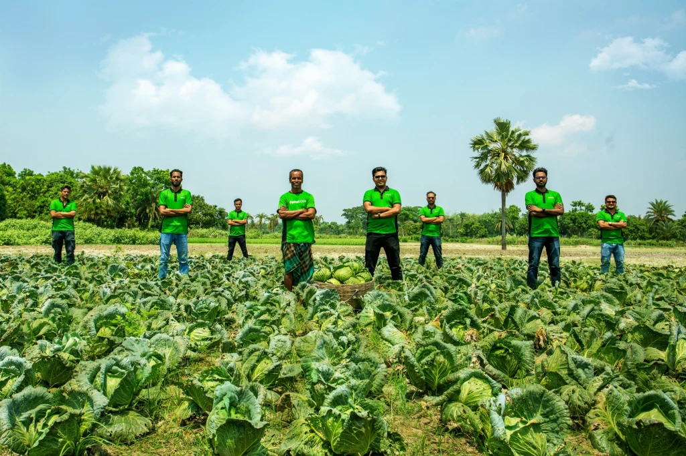

## Navigation

- 01 Overview → index.html
- 02 About → about.html
- 03 Services → services.html
- 04 News → news.html (current)
- 05 Career → career.html
- 06 Contact → contact.html

**CTA:** "Impact data →" → data.html

### Breadcrumb

Overview / News / Tech in Asia / 2023

**CTA:** "← Back to News index" → news.html

# Bangladesh-based startup bags $1m to solve agri-supply problems

**2023.04.18 — Tech in Asia — Investment — Entry 07 / 10**

Tech in Asia covered Fashol's pre-seed close with a regional lens, noting that nearly half of Bangladesh's population works in agriculture and that 70% of the country's land is used to grow crops.

*Fig. 01 — Tech in Asia photograph of Fashol operations.*

## Article body

Nearly 50% of the population in Bangladesh works in agriculture, and 70% of the country's land is used to grow crops. However, the agricultural supply chain remains highly fragmented — with smallholder farmers often receiving less than 20% of the final consumer price.

Tech in Asia's piece framed Fashol's $1 million pre-seed round in this context: as a structural attempt to shorten the chain between smallholder farmers and urban buyers, using software and on-the-ground agents rather than middleman wholesale markets.

The article noted Fashol's growth from 500 farmers in 2020 to over 4,000 at the time of the round, and the company's stated ambition to reach 20,000 farmers within eighteen months — a target that was met in February 2024.

— End of article.

## Entry metadata

- **Date:** 2023.04.18 (2023-04-18)
- **Outlet:** Tech in Asia
- **Category:** Investment
- **By:** Fashol Team
- **Entry:** 07 of 10
- **Source:** [View original](https://www.techinasia.com)

**CTA:** "View original" → https://www.techinasia.com

### Article footer links

- Previous entry → news-6.html
- All news (10) → news.html
- Next entry → news-8.html

## Footer

ফসল — Bengali noun. A harvest.

A farm-to-business platform operating out of Dhaka, Singapore, and Dubai. Founded 2019.

### Site

- Overview → index.html
- About → about.html
- Services → services.html
- News → news.html
- Case study → case-study.html
- Data → data.html
- Career → career.html
- Contact → contact.html

### Offices

- **BD:** 130 Kabbokash, Kawran Bazar, Dhaka 1215
- **SG:** 33A Pagoda Street, Singapore 059192
- **AE:** Office 406, Abdullah Fahed Bldg 2, Al Qussais 2, Dubai

### Direct

- +880 9613 105 505 → tel:+8809613105505
- info@fashol.com → mailto:info@fashol.com
- Facebook → https://www.facebook.com/fasholcom/
- LinkedIn → https://www.linkedin.com/company/fashol?originalSubdomain=bd
- YouTube → https://www.youtube.com/channel/UCMAWUuelzAQc9nYKZ2s-fxQ

© 2019–2026 Fashol Dotcom Limited · Dhaka, Bangladesh · [Privacy](privacy.html) · [Terms](terms.html) · v 2026.04
