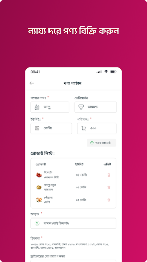
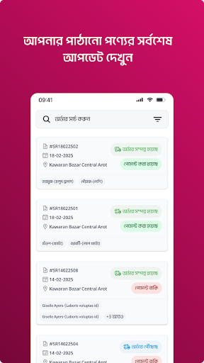
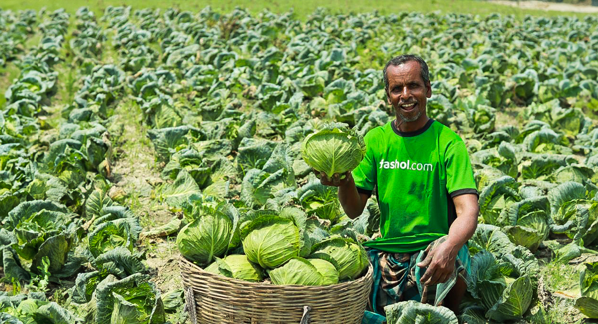
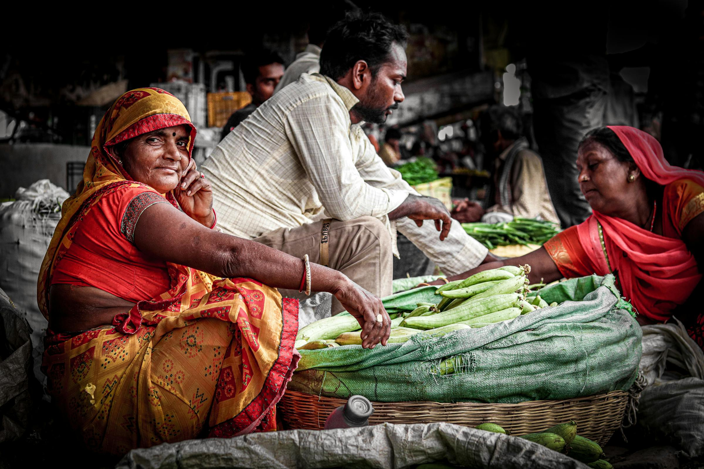
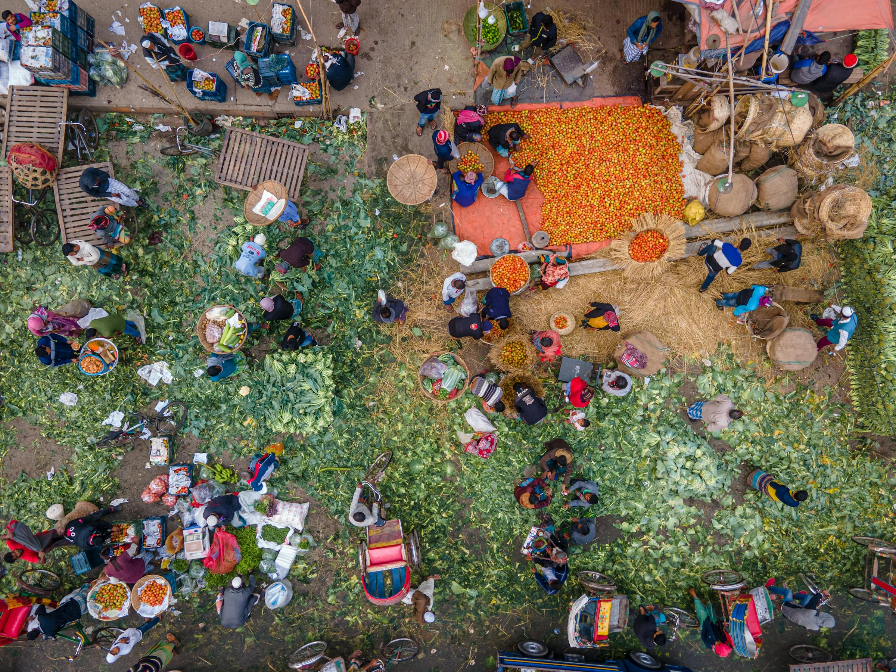
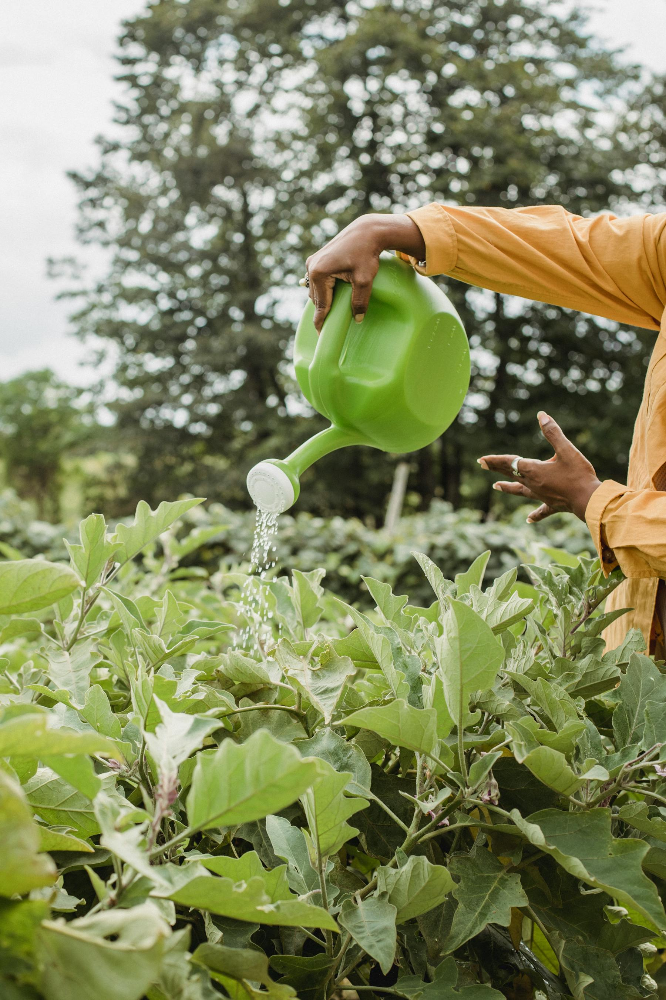
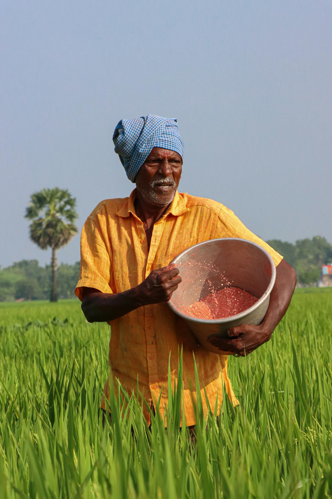
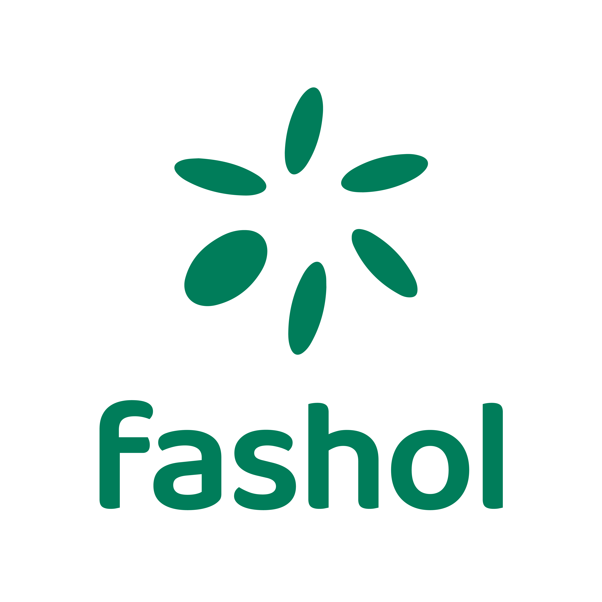

## Navigation

- 01 Overview → index.html
- 02 About → about.html
- 03 Services → services.html (current page)
- 04 News → news.html
- 05 Career → career.html
- 06 Contact → contact.html
- **CTA:** "Impact data →" → data.html

**Breadcrumb:** Overview / Services

# The platform *is* an app in the farmer's hand.

§ Services · যোগান · Jogaan — Android · Play Store · 06 modules behind the app

যোগান Jogaan

Every Fashol service — onboarding, pricing, collection, grading, settlement, and order book — runs through *Jogaan*, the Bengali-first Android app our field agents carry and our farmers receive a notification from at 19:00 each evening. The six modules below are the work that sits behind the app.

### Platform specifications

- **App:** যোগান · Jogaan · Android
- **Language:** Bengali (primary) · English
- **Users:** 25,000+ farmers · 5,000+ buyers · 140 field agents
- **Modules:** 06
- **Settlement:** Within 24 h of weigh-in, to a named bank / bKash account
- **Coverage:** 9 districts · expanding to 15 in 2026

**Fig. 01** — Three Jogaan screens, left to right: onboarding, next-day offer, settlement. The app is also the entry point every service below is routed through.

## § 01 — The six services

### Each module below runs in production today.

### 01 — Farm-to-market platform

#### Direct matching, farmer to buyer.

The base layer. Farmers register through Jogaan, listing crop, quantity, harvest window, and expected price. Buyers post demand. The platform matches the two directly — no aratdars, no price opacity, no delayed settlement.

Pricing is visible to both sides from the point of agreement. Every transaction is logged against a farmer ID that they own and can show to banks, extension officers, or offtakers outside the platform.

- **Tag:** Fashol · B2B
- **Users:** 25,000+ farmers · 5,000+ buyers
- **Coverage:** 09 districts, BD
- **Settlement:** Within 24 hours of weighing

### 02 — Smart logistics network

#### Cold chain where it was never built.

Last-mile pickup and cold-chain dispatch serve forty-plus district hubs, many of them in climate-vulnerable coastal and riverine belts that had no prior cold-chain infrastructure.

Route plans are generated by the platform and executed by company fleet and partner operators. Temperature and dwell-time are logged against each crate so a buyer knows how long a kilo of tomato has been out of cold before it reached them.

- **Tag:** Fleet · Route
- **Hubs:** 40+ distribution hubs
- **Waste:** −26% vs. traditional route
- **Partners:** DITECH (perishables)

### 03 — Buyer solutions

#### Ordering, inventory, and fulfilment for four buyer classes.

Buyers — MSMEs, quick-commerce operators, exporters, wholesalers — use a tailored ordering interface with live inventory, tier-graded produce, and delivery-window visibility.

Bulk and recurring orders are supported. Foodpanda, Chaldal, Daraz, and Domino's are among the 5,000+ buyer accounts currently on the platform.

- **Tag:** SaaS · Retail
- **Classes:** MSME / Quick commerce / Export / Wholesale
- **Known buyers:** Foodpanda, Chaldal, Daraz, Domino's, US-Bangla Airlines
- **SLA:** Same-day & next-day windows

### 04 — Market intelligence

#### Real-time pricing, made available to the grower.

The same price signals that commodity desks and urban wholesalers rely on — published daily to the Jogaan app in Bengali, with a seven-day trailing chart and a twelve-month seasonal comparison.

The audience is smallholder growers in climate-vulnerable districts for whom a day-late price signal is a week-late planting decision.

- **Tag:** Data · Pricing
- **Update:** Daily, every mandi
- **Languages:** Bengali (primary), English
- **Published:** Jogaan app · SMS alerts

### 05 — Quality assurance

#### A four-tier grade applied at hub intake.

Produce is graded on weight, visual defect, storage-life, and provenance before it leaves the district. The tier is set at the hub, not at the urban wholesale market — which is the common practice elsewhere and the origin of most adulteration.

Grade A goes to exporters and quick commerce; Grade B to MSMEs; Grade C to wholesale; Grade D is rejected and routed to animal feed or compost contractors.

- **Tag:** Grade · QC
- **Tiers:** A / B / C / D
- **Applied:** At hub intake, before dispatch
- **Audit:** Quarterly, third-party

### 06 — Financial solvency

#### Twenty-four-hour settlement. Credit against a registered track record.

Farmers are paid through mobile financial services (upay, bKash, Nagad) within 24 hours of weighing — against a traditional 2-to-6-week cycle elsewhere in the chain.

Farmers with a twelve-month track record on the platform qualify for seasonal credit from banking partners, underwritten against their registered volumes rather than their land.

- **Tag:** Payments · Credit
- **Rails:** upay · bKash · Nagad
- **Banking:** Dutch-Bangla Bank (settlement)
- **Cycle:** ≤24 hours from weighing

## § 02 — Jogaan

### যোগান — Jogaan. The app the field runs on.

Bengali verb meaning "to supply." Built for field agents and farmers who handle registration, price lock, collection, and payment on one device.

যোগান Jogaan

#### Grow smart. Sell better.

Available on Google Play for Android 7.0+. Full Bengali localisation; English optional. Field-tested with agents and farmers who have never used a smartphone before.

- **Platform:** Android 7.0+
- **Audience:** Field agents, registered farmers
- **Languages:** Bengali · English
- **Version:** v 3.2 · 2026.02

- **CTA:** "Install on Google Play" → https://play.google.com/store/apps/details?id=com.fashol.agent

## § 03 — Onboard

### Start with one service. Or all six.

- **CTA:** "01 — Register as farmer — Bring your last season's records. WhatsApp a field agent." → https://wa.me/+8801810187230?text=Hello!%20I%E2%80%99d%20like%20to%20register%20as%20a%20farmer%20with%20Fashol.
- **CTA:** "02 — Open a buyer account — MSME, QC, exporter, wholesale — 10-minute set-up." → https://wa.me/+8801810187230?text=Hello!%20I%E2%80%99d%20like%20to%20open%20a%20buyer%20account%20with%20Fashol.
- **CTA:** "03 — Integration & partnerships — Logistics, cold chain, financial rails, NGO partners." → contact.html

## Footer

ফসল — Bengali noun. A harvest.

A farm-to-business platform operating out of Dhaka, Singapore, and Dubai. Founded 2019.

### Site

- Overview → index.html
- About → about.html
- Services → services.html
- News → news.html
- Case study → case-study.html
- Data → data.html
- Career → career.html
- Contact → contact.html

### Offices

- **BD:** 130 Kabbokash, Kawran Bazar, Dhaka 1215
- **SG:** 33A Pagoda Street, Singapore 059192
- **AE:** Office 406, Abdullah Fahed Bldg 2, Al Qussais 2, Dubai

### Direct

- +880 9613 105 505 → tel:+8809613105505
- info@fashol.com → mailto:info@fashol.com
- Facebook → https://www.facebook.com/fasholcom/
- LinkedIn → https://www.linkedin.com/company/fashol?originalSubdomain=bd
- YouTube → https://www.youtube.com/channel/UCMAWUuelzAQc9nYKZ2s-fxQ

© 2019–2026 Fashol Dotcom Limited
Dhaka, Bangladesh
[Privacy](privacy.html) · [Terms](terms.html)
v 2026.04

Fashol · fashol.com
